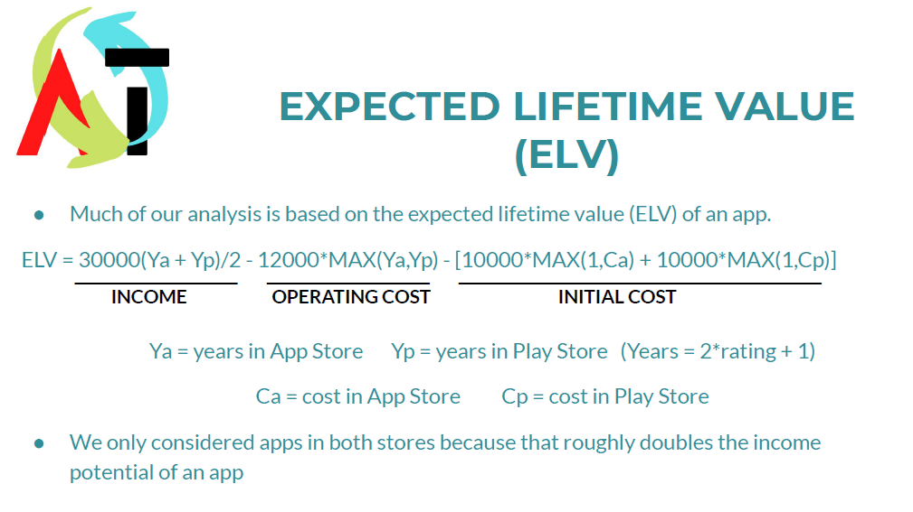
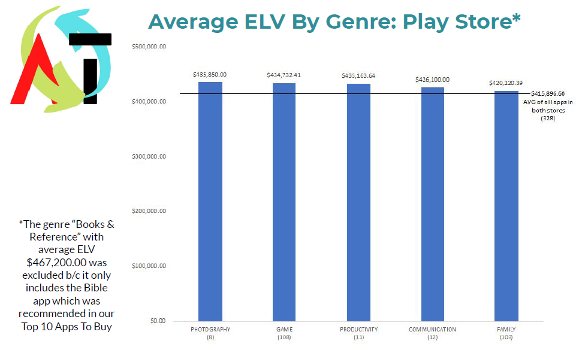

# Description
The main products of this repo are the SQL script used for data analysis and the pdf presentation for the imaginary App Trader company. For the project, I was part of a team whose goal was to analyze Google Play Store and Apple App Store Data to gain insight into profitable app acquisitions based on App Trader's business model. 
#### The final presentation included:
- the Expected Lifetime Value (ELV) formula I developed based on App Trader's business model
- the top ten app purchase recommendations based on this formula
- general recommendations for app price, content rating, and genre based on ELV calculations in these dimensions

# Technologies
- SQL
- PostrgeSQL (pgAdmin)
- Excel
- Google Slides

# Procedures
- creating the app_trader database in pgAdmin by importing a provided backup file
- exploratory data analysis to determine data consistency between the two app stores' tables
- inner-joining the tables to narrow focus on apps in both stores
- developing the ELV formula based on business model assumptions provided by App Trader
- querying the tables with `CTE`s, aggregate functions, and `CASE` statements to retrieve variables needed for ELV calculation
- using `GROUP BY` statements to determine ELV for categories like genre, content rating, and price range
- exporting tables to create visuals in Excel for final presentation
- creating a slide deck with introduction of ELV formula and subsequent recommendations based on ELV
- presenting to App Trader executives and fielding their questions about our results